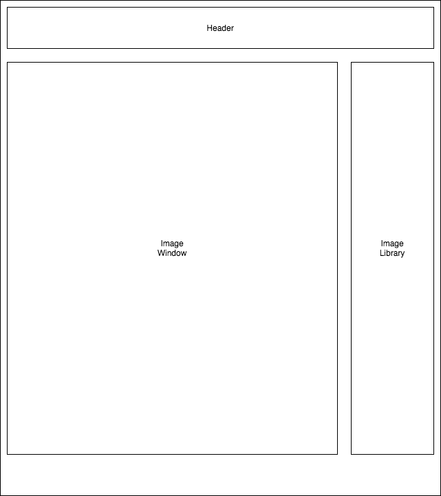

# **Map Notes**

#### Author: **Daniel Merys**
#### July 30, 2020

### Description

_This in-development React application allows a user to create clickable buttons on an image that contain user-fillable text fields. These annotations are stored in a database and are accessible at a later time when accessing the application. _

### Instructions for use:

1. Open Terminal (macOS) or PowerShell (Windows)
2. To download the project Directory to your desktop enter the following commands:
```
cd Desktop
git clone https://github.com/dkmerys/map-notes.git
cd merch-site
```
3. To view the downloaded files, open them in a text editor or IDE of your choice.
* if you have VSCode for example, when your terminal is within the main project Directory you can open all of the files with the command:
```
code .
```
4. Download node and node package manager if they are not already installed on your device. You can find further instructions [here](https://www.learnhowtoprogram.com/intermediate-javascript/getting-started-with-javascript-8d3b52cf-3755-481d-80c5-46f1d3a8ffeb/installing-node-js-14f2721a-61e0-44b3-af1f-73f17348c8f4).
5. Run npm install in your terminal to download the necessary dependencies, plugins, and modules.
```
npm install
```
6. The command npm run start will build and open the compiled code in a browser of your choice using a local host.
```
npm run start
```

### Known Bugs

Future versions of this application will include user authorization and authentication so that images/notes will only be accessible by the user that added them

Annotation functionality has not yet been added.

Clicking 'delete image' on the image detail page only deletes the image object from the database. Does not delete image file from storage.

### Support and Contact Information

Please contact me with any suggestions or questions at dkmerys@gmail.com. Thank you for your input!  
_Have a bug or an issue with this application? [Open a new issue](https://github.com/dkmerys/map-notes/issues) here on GitHub._

### Technologies Used

* JavaScript
* React
* JSX
* HTML
* Firebase/Firestore
* Semantic UI
* React-Image-Annotation
* Git and GitHub

### Specs
| Spec                                                         | Input                                        | Output                                                                                         |
|--------------------------------------------------------------|----------------------------------------------|------------------------------------------------------------------------------------------------|
| User can choose an image to upload an image to cloud storage | Click 'Add Image' button, select file        | Image is uploaded to Firebase, image object is created in database with 'imageURL' as property |
| User can give image a reference name                         | Enter name in "Image Name" field             | Image name is added to object as property                                                      |
| User can view image detail (image is enlarged)               | Click on image                               | Redirected to image detail page                                                                |
| User can delete image                                        | Click on 'delete image' button               | Image object is deleted from database, remains in cloud storage.                               |
| User can edit image reference name                           | Click on 'edit image' button, enter new name | Image name property is changed to match user input                                             |




#### License

This software is licensed under the MIT license.

Copyright © 2020 **_Daniel Merys_**

